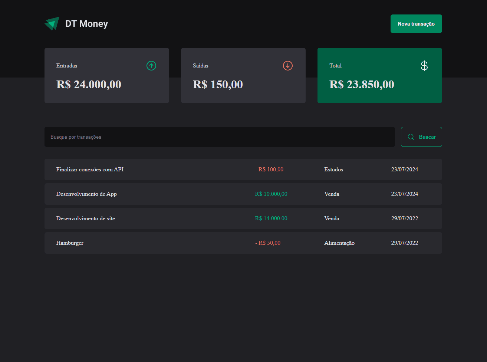

# DT Money - Rocketseat

## Tabela do Conteudos

  * [Introdução](#introdução)
  * [Exposição do projeto](#exposição-do-projeto)
  * [Destaques de códigos](#destaques-de-código)
    * [Consumo de API](#consumo-de-api)
    * [Performance](#performance)
  * [Curiosidade](#curiosidade)
  * [Tecnologias](#tecnologias)

## Introdução

Esse é o terceiro projeto apresentado na formação ReactJS do curso da Rocketseat.

# Exposição do projeto

  

# Destaques de código

Principal propósito desse projeto era além de rever alguns funcionalidades já estudadas no curso, pude aprender principalmente sobre o consumo de APIs, com integrações do front-end ao back-end da aplicação e Performace!

### Consumo de API -

- Pude salvar algumas imagens sobre diferentes métodos de buscar as requisições HTTPs!

  

  
  
  

- Com o Axios podemos visualizar melhor e de fácil configuração!

### Performance -

- Com o React DevTools pude aprender a visualizar o gráfico de renderização de componentes em ``Profiler``, entendo seu fluxo para evitar renderizações desnecessárias no react.

- Com o ``useCallback``, posso fazer com que a função dentro do context seja renderizada apenas 1 vez e quando executado, caso necessite ser atualizada por causa de alguma outra função ou qualquer outra coisa que venha de fora dela, não esquecer de inserir dentro do array de dependências.

- Aprendi a utilizar o ``memo``, para evitar renderização de um componente que não houve alteração, que possua um HTML bem pesado e complexo.

- ``UseMemo`` serve para memorizar uma variável, como no caso abaixo, a minha variável para calcular o valor do summary só será renderizado quando o houver uma alteração no valor do estado de transactions.

## Curiosidade

- A tag ``strong`` vem por padrão inline, ai devemos adicionar o display ``block``, porque sem isso não dá para aplicar uma margem vertical.

- ArialKit, HeadlessUi, ChakraUi e RadixUI são algumas ótimas bibliotecas com suporte a acessibilidade para adicionar elementos.

- Algumas imagens durante a evolução de um ``Contexto``!

  
    
  

  

  

  

## Tecnologias

<ul>
  <li>HTML</li>
  <li>CSS</li>
  <li>JavaScript</li>
  <li>TypeScript</li>
  <li>React</li>
</ul>

### Outros

<ul>
  <li>Styled-Component / @type</li>
  <li>Phosphor-React</li>
  <li>Radix-UI / Dialog / Radio Group</li>
  <li>Json-Server</li>
  <li>Axios</li>
  <li>Use-context-selector react / Scheduler</li>
</ul>
